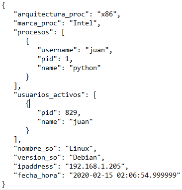

# Compliance continuo de servidores


Aplicación para obtener y centralizar información de los servidores que se encuentran en la nube.


## Estructura del proyecto

* ```/agente```: Contiene un script que se ejecuta en los servidores y envía información de estos a la API.
* ```/API```: Contiene el script inicializador y los controllers/routers de la API.
* ```/createDB```: Contiene el script de creación de la base de datos normalizada.


## Funcionamiento

El programa agente obtiene información del servidor y la envía a la API. La información obtenida consta de los siguientes datos: arquitectura y marca del procesador, nombre y versión del sistema operativo, un listado de los procesos que están corriendo (nombre del proceso, id del proceso y usuario que lo ejecuta), listado de usuarios con una sesión abierta en el sistema (id del proceso y nombre del usuario), la fecha y hora en que fue obtenida la información y la dirección ip del servidor.

El agente envía esta información en formato JSON realizando un request POST.

La API recibe esta información y la almacena en un archivo de texto plano en formato JSON y también en una base de datos normalizada.

La base de datos cuenta con 3 tablas de almacenamiento:

* ```servers```: contiene ip del servidor, fecha y hora en que se envió la información, arquitectura y marca del procesador, nombre y versión del sistema operativo.
* ```procesos```: contiene ip del servidor,  fecha y hora en que se envió la información, id y nombre del procesos en ejecución, usuario que ejecutó el proceso e identificador del registro generado en la tabla Servers.
* ```usuarios_activos```: contiene ip del servidor,  fecha y hora en que se envió la información, nombre del usuario activo, id de proceso e identificador del registro generado en la tabla Servers.

### Estructura general
La Base de datos SQLite, los agentes y la API


### DER de la base de datos


## Instalación y ejecución
* En primer lugar, se debe crear la BD. Para ello, ejecutar el script ```createDB.py``` ubicado en ```/createDB``` con python3. Se generará un archivo en ```API/storage/database``` llamado ```servers.sqlite```
* Luego iniciar la API, ejecutando el script ```init_app.py``` ubicado en ```/API``` con python3.
* Una vez iniciado, en el servidor ejecutar el script ```agente.py``` ubicado en ```/agente``` con python3. Previamente, modificar la IP donde se ejecuta la API en el archivo ```config.ini``` ubicado en ```/agente```.

* Para el correcto funcionamiento de ```agente.py``` son necesarias las librerías ```psutil```, ```netifaces```, ```cpuinfo```, ```datetime``` y ```requests``` en python3.
* Para el correcto funcionamiento de la API son necesarias las librerías ```flask```, ```json```, ```sqlalchemy``` y ```datetime``` en python3.
* Para el correcto funcionamiento de ```createDB.py``` son necesarias las librerías ```sqlalchemy``` y ```pandas``` en python3.

* Para la ejecución de scripts e instalación de librerías también se pueden usar los scripts ```createDB.py```, ``agente.sh``` y ```init_app.sh```.
## API Rest

### Endpoints

El método POST/servers recibe como parámetro un objeto json con el siguiente modelo:



Devuelve como status el código 201 si pudo crear el servidor en la base de datos.
Si ocurre algún error, devuelve como status el código 400


